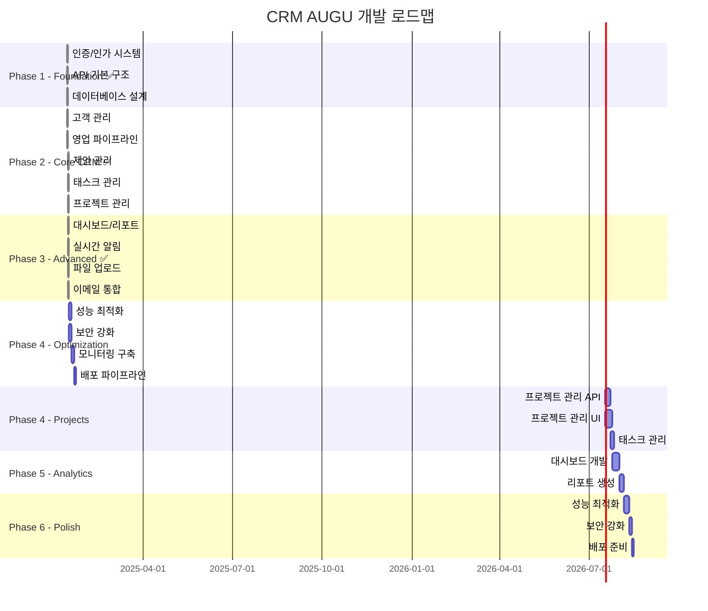

# 🗺️ CRM AUGU 개발 로드맵

## 📋 Executive Summary

**프로젝트 기간**: 12주 (3개월)  
**팀 규모**: 2-4명 권장  
**목표**: Production-ready MVP 출시  
**방법론**: Agile (2주 스프린트)

## 🎯 개발 우선순위 원칙

### 1. 비즈니스 임팩트 우선
- 즉시 사용 가능한 기능부터 개발
- 매출 직결 기능 우선 구현
- 사용자 피드백 빠른 반영

### 2. 기술 부채 최소화
- 확장 가능한 아키텍처 설계
- 테스트 커버리지 80% 유지
- 문서화 동시 진행

### 3. 점진적 개선
- MVP → 기능 확장 → 최적화
- 2주 단위 배포 가능한 증분
- 지속적인 리팩토링

## 📊 개발 단계별 로드맵

### ✅ 완료된 단계
- **Phase 1 - Foundation**: 100% 완료 (2025-01-13)
- **Phase 2 - Core Features**: 100% 완료 (2025-01-14)
- **Phase 3 - Advanced Features**: 100% 완료 (2025-01-14)

### 🚧 진행 예정
- **Phase 4 - Optimization**: 2025-01-15 시작 예정



## 🚀 Phase 1: Foundation (2주)

### 목표
기본 인프라 구축 및 핵심 기능 토대 마련

### 주요 작업

#### Week 1: Backend Foundation
```typescript
// 1. 인증/인가 시스템 (3일)
- [ ] JWT 인증 미들웨어
- [ ] 로그인/로그아웃 API
- [ ] 리프레시 토큰 구현
- [ ] 역할 기반 접근 제어 (RBAC)

// 2. API 기본 구조 (2일)
- [ ] Express 라우터 구조화
- [ ] 에러 핸들링 미들웨어
- [ ] 요청 검증 미들웨어 (Joi)
- [ ] 응답 포맷 표준화
```

#### Week 2: Frontend Foundation
```typescript
// 3. 프론트엔드 기반 (3일)
- [ ] React Router 설정
- [ ] 보호된 라우트 구현
- [ ] 레이아웃 컴포넌트 (Header, Sidebar, Footer)
- [ ] 테마 설정 (Light/Dark)

// 4. 상태 관리 설정 (2일)
- [ ] Redux Toolkit 스토어 설정
- [ ] 인증 상태 관리
- [ ] API 서비스 레이어
- [ ] 에러 처리 시스템
```

### 산출물
- ✅ 로그인/로그아웃 기능
- ✅ 기본 레이아웃
- ✅ 라우팅 시스템
- ✅ API 기본 구조

## 💼 Phase 2: Core CRM Features (3주)

### 목표
고객 관리 핵심 기능 구현

### 주요 작업

#### Week 3-4: Customer Management
```typescript
// Backend (5일)
- [ ] Customer CRUD API
- [ ] Contact CRUD API
- [ ] 고객 검색/필터링
- [ ] 페이지네이션
- [ ] 파일 업로드 (프로필 이미지)

// Frontend (5일)
- [ ] 고객 목록 페이지
- [ ] 고객 상세 페이지
- [ ] 고객 등록/수정 폼
- [ ] 연락처 관리 UI
- [ ] 검색/필터 UI
```

#### Week 5: Activity & Notes
```typescript
// 활동 관리 (3일)
- [ ] Activity 로깅 시스템
- [ ] 활동 타임라인 UI
- [ ] 활동 유형별 아이콘/색상

// 노트 시스템 (2일)
- [ ] Note CRUD API
- [ ] 노트 에디터 UI
- [ ] 노트 첨부파일
```

### 산출물
- ✅ 고객 관리 (CRUD)
- ✅ 연락처 관리
- ✅ 활동 기록
- ✅ 노트 시스템

## 📈 Phase 3: Sales Pipeline (3주)

### 목표
영업 프로세스 자동화 및 파이프라인 관리

### 주요 작업

#### Week 6-7: Opportunity Management
```typescript
// 영업 기회 관리 (7일)
- [ ] Opportunity CRUD API
- [ ] 단계별 이동 로직
- [ ] 확률/금액 계산
- [ ] 칸반 보드 UI
- [ ] 드래그&드롭 기능
- [ ] 기회 상세 모달

// 영업 활동 추적 (3일)
- [ ] 영업 활동 로깅
- [ ] 다음 액션 알림
- [ ] 활동 보고서
```

#### Week 8: Pipeline Analytics
```typescript
// 파이프라인 분석 (5일)
- [ ] 단계별 전환율
- [ ] 평균 거래 기간
- [ ] 예상 매출 계산
- [ ] 영업 깔때기 차트
- [ ] 실시간 대시보드
```

### 산출물
- ✅ 영업 파이프라인 (칸반)
- ✅ 기회 관리
- ✅ 영업 분석 대시보드
- ✅ 예상 매출 리포트

## 📊 Phase 4: Project Management (2주)

### 목표
프로젝트 실행 관리 및 리소스 추적

### 주요 작업

#### Week 9-10: Project & Task
```typescript
// 프로젝트 관리 (5일)
- [ ] Project CRUD API
- [ ] 프로젝트 타임라인
- [ ] 마일스톤 관리
- [ ] 간트 차트 UI
- [ ] 프로젝트 대시보드

// 태스크 관리 (5일)
- [ ] Task CRUD API
- [ ] 태스크 할당
- [ ] 우선순위 관리
- [ ] 진행률 추적
- [ ] 캘린더 뷰
```

### 산출물
- ✅ 프로젝트 관리
- ✅ 태스크 트래킹
- ✅ 리소스 할당
- ✅ 진행률 모니터링

## 📊 Phase 5: Analytics & Reporting (2주)

### 목표
비즈니스 인사이트 제공 및 의사결정 지원

### 주요 작업

#### Week 11: Dashboard
```typescript
// 대시보드 개발 (5일)
- [ ] KPI 위젯 시스템
- [ ] 실시간 데이터 업데이트
- [ ] 커스터마이징 기능
- [ ] 차트 라이브러리 통합
- [ ] 드릴다운 기능
```

#### Week 12: Reports
```typescript
// 리포트 생성 (5일)
- [ ] 리포트 템플릿
- [ ] PDF/Excel 내보내기
- [ ] 예약 리포트
- [ ] 이메일 발송
- [ ] 리포트 공유
```

### 산출물
- ✅ 실시간 대시보드
- ✅ 커스텀 리포트
- ✅ 데이터 시각화
- ✅ 내보내기 기능

## 🔧 Phase 6: Optimization & Deployment (1주)

### 목표
성능 최적화 및 프로덕션 배포 준비

### 주요 작업

```typescript
// 성능 최적화 (3일)
- [ ] 쿼리 최적화
- [ ] 캐싱 전략 구현
- [ ] 번들 사이즈 최적화
- [ ] 이미지 최적화
- [ ] Lazy Loading

// 보안 강화 (2일)
- [ ] 보안 감사
- [ ] Rate Limiting
- [ ] HTTPS 설정
- [ ] 환경 변수 관리
- [ ] 로그 시스템

// 배포 준비 (2일)
- [ ] CI/CD 파이프라인
- [ ] 도커 이미지 생성
- [ ] 모니터링 설정
- [ ] 백업 전략
- [ ] 문서 정리
```

### 산출물
- ✅ 성능 개선 (< 2초 로딩)
- ✅ 보안 강화
- ✅ 배포 자동화
- ✅ 운영 문서

## 🎯 주요 마일스톤

| 주차 | 마일스톤 | 주요 기능 | 완료 기준 |
|------|----------|-----------|-----------|
| 2주 | Foundation Complete | 인증, 라우팅 | 로그인 가능 |
| 5주 | CRM Core Ready | 고객 관리 | CRUD 완성 |
| 8주 | Sales Module Done | 영업 파이프라인 | 기회 추적 가능 |
| 10주 | Project Module Done | 프로젝트 관리 | 태스크 할당 가능 |
| 12주 | MVP Complete | 전체 시스템 | 운영 가능 |

## 📈 성공 지표 (KPI)

### 기술적 지표
- **코드 커버리지**: 80% 이상
- **빌드 시간**: 5분 이내
- **페이지 로드**: 2초 이내
- **API 응답**: 200ms 이내 (P95)
- **가용성**: 99.9%

### 비즈니스 지표
- **사용자 만족도**: NPS 40 이상
- **일일 활성 사용자**: 50명 이상
- **데이터 정확도**: 99.9%
- **버그 발생률**: 스프린트당 5개 이하

## 🔄 리스크 관리

### 주요 리스크 및 대응 방안

| 리스크 | 확률 | 영향 | 대응 방안 |
|--------|------|------|-----------|
| 일정 지연 | 중 | 높음 | 버퍼 시간 20% 확보 |
| 기술 난이도 | 낮음 | 중간 | 프로토타입 먼저 개발 |
| 요구사항 변경 | 높음 | 중간 | 애자일 방법론 적용 |
| 성능 이슈 | 중 | 높음 | 부하 테스트 정기 실시 |
| 보안 취약점 | 낮음 | 매우 높음 | 보안 감사 필수 |

## 🏃 스프린트 계획

### 스프린트 구조 (2주)
```
Week 1:
- 월: 스프린트 계획 (2시간)
- 화-금: 개발
- 금: 코드 리뷰

Week 2:
- 월-목: 개발 + 테스트
- 금: 스프린트 리뷰 + 회고
```

### 일일 스탠드업
- 시간: 오전 10시 (15분)
- 내용: 어제 한 일, 오늘 할 일, 블로커

## 📚 기술 부채 관리

### 우선순위 기준
1. **Critical**: 보안, 데이터 손실 위험
2. **High**: 성능, 확장성 제약
3. **Medium**: 코드 품질, 유지보수성
4. **Low**: 코드 스타일, 문서화

### 부채 상환 계획
- 매 스프린트 20% 시간 할당
- 분기별 리팩토링 스프린트
- 지속적인 의존성 업데이트

## ✅ 체크리스트

### 각 Phase 완료 기준
- [ ] 모든 기능 구현 완료
- [ ] 단위 테스트 작성 (80% 커버리지)
- [ ] 통합 테스트 통과
- [ ] 코드 리뷰 완료
- [ ] 문서 업데이트
- [ ] 성능 테스트 통과
- [ ] 보안 점검 완료

## 🎓 팀 역량 개발

### 필요 기술 스택
- **필수**: TypeScript, React, Node.js, PostgreSQL
- **권장**: Docker, Redis, Socket.io
- **선택**: Kubernetes, GraphQL, Elasticsearch

### 학습 리소스
- 공식 문서 스터디 (주 1회)
- 코드 리뷰 세션 (주 2회)
- 기술 공유 세미나 (월 1회)

---

**"작은 성공을 빠르게, 자주 만들어 나가는 것이 핵심입니다."**

## 🚦 Go/No-Go 결정 포인트

### Phase 2 완료 시점 (5주차)
- **Go 조건**: 고객 관리 기능 완성, 사용자 피드백 긍정적
- **No-Go 시**: 아키텍처 재검토, 요구사항 재정의

### Phase 4 완료 시점 (10주차)
- **Go 조건**: 핵심 기능 모두 작동, 성능 목표 달성
- **No-Go 시**: 출시 일정 조정, 기능 우선순위 재조정

---

*이 로드맵은 프로젝트 진행 상황에 따라 유연하게 조정될 수 있습니다.*