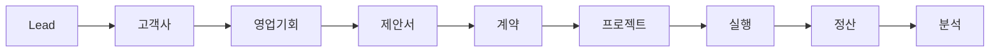

# CRM AUGU - 기능 정의서 (Functional Requirements Document)

## 📋 목차
1. [시스템 개요](#1-시스템-개요)
2. [핵심 모듈 정의](#2-핵심-모듈-정의)
3. [모듈별 상세 기능 명세](#3-모듈별-상세-기능-명세)
4. [비즈니스 규칙](#4-비즈니스-규칙)
5. [통합 요구사항](#5-통합-요구사항)

---

## 1. 시스템 개요

### 1.1 비전
"영업부터 정산까지, 모든 순간을 데이터로 연결하여 HRD 컨설팅의 가치를 극대화하는 지능형 플랫폼"

### 1.2 핵심 가치
- **Fast**: 빠른 실행과 개선 (2주 스프린트)
- **Integrated**: 완전한 통합 (Single Source of Truth)
- **Reliable**: 99.9% 가용성 목표
- **Simple**: 3클릭 룰 적용
- **Transparent**: 실시간 대시보드 공유

### 1.3 시스템 목표
| 목표 | 현재 | 목표치 | 개선율 |
|------|------|--------|--------|
| 영업 사이클 | 45일 | 30일 | 33% 단축 |
| 고객 만족도 (NPS) | 85점 | 95점 | 12% 향상 |
| 프로젝트 수익률 | 25% | 35% | 40% 개선 |
| 운영 비용 | 100% | 75% | 25% 절감 |

---

## 2. 핵심 모듈 정의

### 2.1 모듈 계층 구조
```
CRM AUGU
├── 🎯 영업관리 (Sales Management)
│   ├── Lead 관리
│   ├── 고객사 관리
│   ├── 영업기회 관리
│   └── 제안/계약 관리
│
├── 📊 프로젝트 관리 (Project Management)
│   ├── 프로젝트 계획
│   ├── 리소스 관리
│   ├── 일정 관리
│   └── 산출물 관리
│
├── 💰 재무관리 (Financial Management)
│   ├── 견적/계약
│   ├── 매출/비용
│   ├── 정산
│   └── 보고서
│
├── 👥 인적자원 관리 (Human Resource)
│   ├── 강사 관리
│   ├── 일정 배정
│   ├── 평가 관리
│   └── 강사료 정산
│
└── 📈 분석/대시보드 (Analytics)
    ├── 영업 분석
    ├── 프로젝트 분석
    ├── 재무 분석
    └── 성과 지표
```

### 2.2 모듈간 데이터 흐름


---

## 3. 모듈별 상세 기능 명세

### 3.1 영업관리 모듈 (Sales Management)

#### 3.1.1 Lead 관리
| 기능 ID | 기능명 | 설명 | 우선순위 | 비고 |
|---------|--------|------|----------|------|
| SM-L001 | Lead 등록 | 신규 잠재고객 정보 등록 | P1 | 자동 중복 체크 |
| SM-L002 | Lead 스코어링 | BANT 기준 자동 점수 산정 | P1 | AI 기반 |
| SM-L003 | Lead 배정 | 담당자 자동/수동 배정 | P1 | 규칙 기반 |
| SM-L004 | Lead 전환 | Lead → 제안 전환 | P1 | 팀/담당자 배정 |
| SM-L005 | 팀 배정 워크플로우 | Lead→제안 시 팀 배정 | P1 | 승인 프로세스 |
| SM-L006 | 전담자 지정 | 영업/운영 담당자 지정 | P1 | 역할별 배정 |
| SM-L007 | Lead 너처링 | 육성 캠페인 관리 | P2 | 자동화 |
| SM-L008 | Lead 분석 | 소스별/채널별 분석 | P2 | 대시보드 |

**Lead 스코어링 기준 (BANT)**
```typescript
interface BANTScore {
  budget: number;      // 예산 (0-25점)
  authority: number;   // 결정권 (0-25점)
  need: number;        // 필요성 (0-25점)
  timeline: number;    // 시급성 (0-25점)
  total: number;       // 합계 (0-100점)
}

// 스코어별 액션
const scoreActions = {
  "80-100": "Hot Lead - 즉시 연락",
  "60-79": "Warm Lead - 2일 이내 연락",
  "40-59": "Cool Lead - 너처링 필요",
  "0-39": "Cold Lead - 장기 육성"
};
```

**Lead → 제안 전환 시 팀/담당자 배정 프로세스**
```typescript
interface LeadToProposalAssignment {
  // Step 1: Lead 평가
  leadEvaluation: {
    score: number;
    industry: string;
    expectedValue: number;
    complexity: 'LOW' | 'MEDIUM' | 'HIGH';
  };
  
  // Step 2: 팀 배정
  teamAssignment: {
    salesTeam: {
      teamId: string;
      teamName: string;
      specialty: string[];     // 전문 분야
      capacity: number;         // 가용 여력
    };
    criteria: {
      industryMatch: boolean;
      expertiseMatch: boolean;
      capacityAvailable: boolean;
    };
  };
  
  // Step 3: 담당자 지정
  roleAssignment: {
    accountManager: {       // 영업 담당자
      userId: string;
      name: string;
      role: 'ACCOUNT_MANAGER';
      responsibilities: [
        '고객 관계 관리',
        '제안서 작성',
        '계약 협상'
      ];
    };
    solutionArchitect?: {   // 솔루션 설계자
      userId: string;
      name: string;
      role: 'SOLUTION_ARCHITECT';
      responsibilities: [
        '교육 과정 설계',
        '커리큘럼 개발'
      ];
    };
    projectCoordinator?: {  // 프로젝트 코디네이터
      userId: string;
      name: string;
      role: 'PROJECT_COORDINATOR';
      responsibilities: [
        '일정 조율',
        '리소스 관리'
      ];
    };
  };
  
  // Step 4: 승인 워크플로우
  approvalWorkflow: {
    requiredApprovals: ApprovalLevel[];
    currentStatus: 'PENDING' | 'APPROVED' | 'REJECTED';
    approvalHistory: ApprovalRecord[];
  };
}

enum ApprovalLevel {
  TEAM_LEADER = 'Team Leader Approval',
  SALES_MANAGER = 'Sales Manager Approval',
  DIRECTOR = 'Director Approval'  // for high-value opportunities
}
```

#### 3.1.2 고객사 관리 (Customer) - 3계층 구조
| 기능 ID | 기능명 | 설명 | 우선순위 | 비고 |
|---------|--------|------|----------|------|
| SM-C001 | 회사 등록 | 모기업 정보 등록 | P1 | 사업자번호 검증 |
| SM-C002 | 사업장 관리 | 회사 하위 사업장 등록 | P1 | 다중 사업장 |
| SM-C003 | 담당자 관리 | 사업장별 담당자 관리 | P1 | 계층별 관리 |
| SM-C004 | 조직도 관리 | 3계층 조직 구조 관리 | P1 | 드래그앤드롭 |
| SM-C005 | 커뮤니케이션 이력 | 모든 접촉 기록 | P1 | 타임라인 뷰 |
| SM-C006 | 계약 이력 | 과거 계약 조회 | P1 | 재계약 알림 |
| SM-C007 | 고객 등급 관리 | VIP/일반/신규 분류 | P2 | 자동 등급 조정 |
| SM-C008 | 고객 건강도 | Customer Health Score | P2 | 이탈 예측 |

**고객 3계층 구조**
```typescript
interface CustomerHierarchy {
  // Level 1: 회사 (Company)
  company: {
    id: string;
    name: string;              // 회사명
    businessNumber: string;    // 사업자번호
    representative: string;    // 대표자
    headquartersAddress: Address;
    industry: Industry;
    size: CompanySize;
    tier: CustomerTier;
  };
  
  // Level 2: 사업장 (Branch/Division)
  branches: {
    id: string;
    companyId: string;
    name: string;              // 사업장명
    type: 'HEADQUARTERS' | 'BRANCH' | 'FACTORY' | 'LAB';
    address: Address;
    manager: string;           // 사업장 책임자
    employeeCount: number;
    businessScope: string[];   // 사업 영역
  }[];
  
  // Level 3: 담당자 (Contact)
  contacts: {
    id: string;
    branchId: string;          // 소속 사업장
    name: string;
    position: string;
    department: string;
    role: 'DECISION_MAKER' | 'INFLUENCER' | 'USER' | 'CHAMPION';
    email: string;
    phone: string;
    mobile: string;
    isPrimary: boolean;
  }[];
}

// 고객 세그먼테이션
interface CustomerSegment {
  tier: 'VIP' | 'GOLD' | 'SILVER' | 'BRONZE';
  criteria: {
    annualRevenue: number;    // 연간 매출
    projectCount: number;      // 프로젝트 수
    satisfaction: number;      // 만족도
    paymentScore: number;      // 결제 신용도
  };
  benefits: string[];          // 등급별 혜택
}
```

#### 3.1.3 영업기회 관리 (Opportunity)
| 기능 ID | 기능명 | 설명 | 우선순위 | 비고 |
|---------|--------|------|----------|------|
| SM-O001 | 기회 생성 | 영업기회 등록 | P1 | Lead 연계 |
| SM-O002 | 파이프라인 관리 | 단계별 진행 관리 | P1 | 칸반 보드 |
| SM-O003 | 확률/금액 계산 | 예상 매출 자동 계산 | P1 | 가중치 적용 |
| SM-O004 | 경쟁사 추적 | 경쟁 현황 관리 | P2 | Win/Loss 분석 |
| SM-O005 | 협업 관리 | 팀 협업 기능 | P2 | 멘션/코멘트 |
| SM-O006 | 예측 분석 | AI 성공률 예측 | P3 | ML 모델 |

**영업 파이프라인 단계**
```typescript
enum OpportunityStage {
  QUALIFYING = "검증",        // 10%
  NEEDS_ANALYSIS = "니즈분석", // 25%
  PROPOSAL = "제안",          // 50%
  NEGOTIATION = "협상",       // 75%
  CLOSED_WON = "수주",        // 100%
  CLOSED_LOST = "실주"        // 0%
}

interface StageRequirements {
  [OpportunityStage.QUALIFYING]: ['담당자 확인', '예산 확인'];
  [OpportunityStage.NEEDS_ANALYSIS]: ['요구사항 문서', '미팅 기록'];
  [OpportunityStage.PROPOSAL]: ['제안서 작성', '견적서 작성'];
  [OpportunityStage.NEGOTIATION]: ['계약서 초안', '협상 이력'];
}
```

### 3.2 프로젝트 관리 모듈 (Project Management) - HRD 특화

#### 3.2.1 프로젝트 계획 및 운영
| 기능 ID | 기능명 | 설명 | 우선순위 | 비고 |
|---------|--------|------|----------|------|
| PM-P001 | 프로젝트 생성 | 교육 프로젝트 생성 | P1 | HRD 템플릿 |
| PM-P002 | 차수 관리 | 교육 차수 설정/관리 | P1 | 다중 차수 지원 |
| PM-P003 | 분반 관리 | 차수별 분반 설정 | P1 | 병렬 운영 |
| PM-P004 | 운영자 배정 | PM/운영담당 배정 | P1 | 역할별 권한 |
| PM-P005 | 진행자 배정 | 차수/분반별 진행자 | P1 | 강사 매칭 |
| PM-P006 | 커리큘럼 관리 | 교육 과정 설계 | P1 | 모듈화 |
| PM-P007 | 수강생 관리 | 차수/분반별 수강생 | P1 | 출결 관리 |
| PM-P008 | 교육장 관리 | 장소/시설 예약 | P2 | 리소스 관리 |
| PM-P009 | 교재 관리 | 교육 자료 버전 관리 | P2 | 차수별 커스텀 |

**HRD 프로젝트 구조 (차수/분반)**
```typescript
interface HRDProject {
  // 프로젝트 기본 정보
  project: {
    id: string;
    name: string;
    customer: Customer;
    contract: Contract;
    type: 'LEADERSHIP' | 'SALES' | 'CS' | 'TECHNICAL' | 'ONBOARDING';
    totalParticipants: number;
    budget: number;
  };
  
  // 운영 담당자 배정
  assignments: {
    projectManager: {          // 프로젝트 매니저
      userId: string;
      name: string;
      responsibilities: [
        '전체 프로젝트 관리',
        '고객 커뮤니케이션',
        '품질 관리'
      ];
    };
    operationManager: {        // 운영 매니저
      userId: string;
      name: string;
      responsibilities: [
        '교육 운영 총괄',
        '강사 관리',
        '현장 지원'
      ];
    };
    coordinators: {           // 코디네이터 (차수별)
      sessionId: string;
      userId: string;
      name: string;
      responsibilities: [
        '차수 운영',
        '수강생 관리',
        '행정 지원'
      ];
    }[];
  };
  
  // 차수 (Session/Round)
  sessions: {
    id: string;
    sessionNumber: number;     // 차수 번호
    startDate: Date;
    endDate: Date;
    status: 'PLANNED' | 'IN_PROGRESS' | 'COMPLETED';
    
    // 분반 (Class)
    classes: {
      id: string;
      className: string;       // 분반명 (A반, B반)
      instructor: Instructor;  // 강사
      participants: Participant[]; // 수강생
      location: Location;      // 교육장
      schedule: Schedule[];    // 세부 일정
      materials: Material[];   // 교재/자료
    }[];
    
    totalParticipants: number;
    coordinator: User;        // 차수 담당자
  }[];
  
  // 프로젝트 단계별 담당자 역할
  roleMatrix: {
    phase: ProjectPhase;
    responsible: User;         // 책임자
    accountable: User;        // 승인자
    consulted: User[];        // 협의자
    informed: User[];         // 통보자
  }[];
}

// 차수/분반 운영 상세
interface SessionOperation {
  session: {
    id: string;
    number: number;
    dates: DateRange;
    
    // 분반별 운영 현황
    classOperations: {
      classId: string;
      className: string;
      
      schedule: {
        date: Date;
        startTime: string;
        endTime: string;
        topic: string;
        instructor: Instructor;
        room: string;
      }[];
      
      attendance: {
        date: Date;
        present: number;
        absent: number;
        late: number;
        excused: number;
      }[];
      
      evaluation: {
        instructorScore: number;  // 강사 만족도
        contentScore: number;     // 콘텐츠 만족도
        overallScore: number;     // 전체 만족도
        feedback: string[];
      };
    }[];
  };
}
```

#### 3.2.2 리소스 관리
| 기능 ID | 기능명 | 설명 | 우선순위 | 비고 |
|---------|--------|------|----------|------|
| PM-R001 | 강사 배정 | 차수/분반별 강사 배정 | P1 | 자동 추천 |
| PM-R002 | 일정 조율 | 캘린더 통합 | P1 | 충돌 검사 |
| PM-R003 | 부하 분산 | 리소스 평준화 | P2 | 최적화 알고리즘 |
| PM-R004 | 대체자 관리 | 백업 강사 pool | P2 | 우선순위 관리 |

**강사 매칭 알고리즘**
```typescript
interface InstructorMatching {
  requirements: {
    skills: string[];        // 필요 역량
    location: string;        // 교육 장소
    dates: Date[];          // 교육 일정
    level: 'BASIC' | 'INTERMEDIATE' | 'ADVANCED';
  };
  
  scoring: {
    skillMatch: number;      // 역량 일치도 (40%)
    availability: number;    // 가용성 (30%)
    performance: number;     // 과거 성과 (20%)
    distance: number;        // 거리 (10%)
  };
  
  result: {
    primary: Instructor;     // 1순위
    backup: Instructor[];    // 대체 강사
  };
}
```

### 3.3 미팅관리 모듈 (Meeting Management) - 전략적 기록관리

#### 3.3.1 미팅 계층 구조
| 기능 ID | 기능명 | 설명 | 우선순위 | 비고 |
|---------|--------|------|----------|------|
| MM-M001 | 미팅 분류 체계 | 고객/내부 미팅 구분 | P1 | 계층화 |
| MM-M002 | 단계별 미팅 관리 | 영업 단계별 미팅 추적 | P1 | 템플릿 제공 |
| MM-M003 | 미팅 기록 표준화 | 구조화된 기록 양식 | P1 | 필수 항목 검증 |
| MM-M004 | 후속 조치 관리 | Action Item 추적 | P1 | 자동 알림 |
| MM-M005 | 미팅 성과 분석 | 미팅 효과성 측정 | P2 | KPI 연동 |
| MM-M006 | 미팅 자료 관리 | 관련 문서 연결 | P2 | 버전 관리 |

**미팅 분류 체계**
```typescript
interface MeetingClassification {
  // Level 1: 미팅 대상
  target: {
    CUSTOMER: {      // 고객 미팅
      types: ['INITIAL', 'PROPOSAL', 'OPERATION', 'FOLLOWUP'];
      participants: 'External stakeholders';
    };
    INTERNAL: {      // 내부 미팅
      types: ['TEAM', 'CROSS_DEPARTMENT', 'MANAGEMENT', 'PARTNER'];
      participants: 'Internal teams & partners';
    };
  };
  
  // Level 2: 영업 단계별 고객 미팅
  customerMeetingStages: {
    INITIAL: {       // 초기 미팅
      purpose: '관계 구축 및 니즈 파악';
      duration: '영업 초기 단계';
      keyActivities: ['인사', '회사 소개', '니즈 탐색'];
    };
    CONSULTATION: {  // 상담/제안 미팅
      purpose: '솔루션 제안 및 협상';
      duration: '제안~계약 단계';
      keyActivities: ['제안 설명', '조건 협상', 'POC'];
    };
    OPERATION: {     // 교육 운영 미팅
      purpose: '프로젝트 실행 관리';
      duration: '프로젝트 진행 중';
      keyActivities: ['킥오프', '중간 점검', '이슈 해결'];
    };
    FOLLOWUP: {      // 사후관리 미팅
      purpose: '관계 유지 및 추가 기회';
      duration: '프로젝트 완료 후';
      keyActivities: ['만족도 확인', '추가 니즈', '레퍼런스'];
    };
  };
  
  // Level 3: 내부 미팅 유형
  internalMeetingTypes: {
    TEAM: {          // 팀 미팅
      purpose: '팀 내 협업';
      frequency: 'Weekly/Daily';
      participants: ['Team members'];
    };
    CROSS_DEPT: {    // 부서간 미팅
      purpose: '부서간 협력';
      frequency: 'As needed';
      participants: ['Multiple departments'];
    };
    PARTNER: {       // 협력사 미팅
      purpose: '파트너 협업';
      frequency: 'Project-based';
      participants: ['Partners', 'Vendors'];
    };
    MANAGEMENT: {    // 경영 미팅
      purpose: '의사결정';
      frequency: 'Regular/Ad-hoc';
      participants: ['Executives', 'Managers'];
    };
  };
}
```

#### 3.3.2 고객 미팅 상세 기록 체계

**초기 미팅 (Initial Meeting)**
```typescript
interface InitialMeetingRecord {
  // 기본 정보
  meetingInfo: {
    date: Date;
    duration: number;
    location: string;
    type: 'FACE_TO_FACE' | 'VIDEO' | 'PHONE';
  };
  
  // 참석자
  attendees: {
    customer: {
      name: string;
      position: string;
      role: 'DECISION_MAKER' | 'INFLUENCER' | 'USER';
      firstImpression: string;
    }[];
    internal: {
      name: string;
      role: string;
    }[];
  };
  
  // 니즈 파악
  needsDiscovery: {
    businessChallenges: string[];    // 비즈니스 과제
    currentSituation: string;        // 현재 상황
    desiredOutcome: string;          // 원하는 결과
    timeline: string;                 // 시급성
    budget: {
      confirmed: boolean;
      range?: string;
      decisionProcess: string;
    };
  };
  
  // BANT 평가
  bantAssessment: {
    budget: { score: number; notes: string; };
    authority: { score: number; notes: string; };
    need: { score: number; notes: string; };
    timeline: { score: number; notes: string; };
    totalScore: number;
  };
  
  // 관계 구축
  relationshipBuilding: {
    rapport: 'EXCELLENT' | 'GOOD' | 'NEUTRAL' | 'DIFFICULT';
    commonGround: string[];          // 공통 관심사
    keyInsights: string[];           // 핵심 인사이트
  };
  
  // Next Steps
  nextSteps: {
    actions: {
      task: string;
      owner: string;
      dueDate: Date;
    }[];
    nextMeeting?: Date;
    followUpRequired: string[];
  };
}
```

**상담/제안 미팅 (Consultation & Proposal Meeting)**
```typescript
interface ProposalMeetingRecord {
  // 제안 정보
  proposalDetails: {
    proposalId: string;
    version: string;
    presentationType: 'FORMAL' | 'INFORMAL' | 'WORKSHOP';
  };
  
  // 제품/서비스 매칭 (상품 마스터 연동)
  productMapping: {
    products: {
      productId: string;        // 상품 마스터 ID
      productName: string;
      category: string;
      customization: string[];   // 커스터마이징 요소
    }[];
    
    // 핵심 차별점 (3개 불릿포인트)
    keyDifferentiators: [
      { point: string; impact: string; },
      { point: string; impact: string; },
      { point: string; impact: string; }
    ];
    
    // ROI 제시
    roiPresentation: {
      presented: boolean;
      type: ('QUANTITATIVE' | 'QUALITATIVE')[];
      details?: {
        quantitative?: {
          investment: number;
          return: number;
          paybackPeriod: string;
          irr?: number;
        };
        qualitative?: string[];
      };
    };
  };
  
  // 고객 반응
  customerResponse: {
    overallReaction: 'VERY_POSITIVE' | 'POSITIVE' | 'NEUTRAL' | 'RESERVED';
    reactionEmoji: '😍' | '😊' | '😐' | '🤔';
    
    concerns: {
      price: boolean;
      timeline: boolean;
      internalCapability: boolean;
      changeResistance: boolean;
      other?: string[];
    };
    
    positivePoints: string[];        // 긍정적 반응 포인트
    objections: {                    // 이의 사항
      objection: string;
      response: string;
      resolved: boolean;
    }[];
  };
  
  // 경쟁 상황
  competitionStatus: {
    situation: 'SOLE' | 'LIMITED' | 'COMPETITIVE';
    competitors?: {
      name: string;
      strengths: string[];
      weaknesses: string[];
      ourAdvantage: string;
    }[];
  };
  
  // 협상 단계
  negotiationStage: 'PROPOSAL_REVIEW' | 'DETAILED_DISCUSSION' | 'TERMS_NEGOTIATION' | 'FINAL_REVIEW';
  
  // Next Steps
  commitment: {
    specificPromise: string;          // 구체적 약속
    expectedClosing: Date;            // 예상 클로징
    probability: number;              // 성공 확률
    nextActions: {
      action: string;
      owner: string;
      deadline: Date;
    }[];
  };
}
```

**교육 운영 미팅 (Delivery Meeting)**
```typescript
interface DeliveryMeetingRecord {
  // 프로젝트 상태
  projectStatus: {
    projectId: string;
    sessionId?: string;               // 차수 ID
    progress: number;                 // 진행률
    scheduleAdherence: 'ON_TRACK' | 'AT_RISK' | 'DELAYED';
    qualityScore: number;             // 1-5 점
  };
  
  // 실행 이슈
  executionIssues: {
    issue: string;
    severity: 'HIGH' | 'MEDIUM' | 'LOW';
    impact: string;
    resolution: string;
    status: 'OPEN' | 'IN_PROGRESS' | 'RESOLVED';
  }[];
  
  // 고객 피드백
  customerFeedback: {
    participantEngagement: 'HIGH' | 'MEDIUM' | 'LOW';
    satisfactionScore: number;       // 1-5 점
    
    feedback: {
      category: 'CONTENT' | 'INSTRUCTOR' | 'LOGISTICS' | 'OTHER';
      type: 'POSITIVE' | 'NEGATIVE' | 'SUGGESTION';
      detail: string;
      actionRequired: boolean;
    }[];
    
    npsScore?: number;                // -100 to 100
    recommendationLikelihood: 'HIGH' | 'MEDIUM' | 'LOW';
  };
  
  // 변경 요청
  changeRequests: {
    request: string;
    type: 'SCOPE' | 'SCHEDULE' | 'RESOURCE';
    impact: string;
    decision: 'APPROVED' | 'REJECTED' | 'PENDING';
    notes: string;
  }[];
  
  // 성과 측정
  performanceMetrics: {
    attendanceRate: number;
    completionRate: number;
    learningObjectivesMet: boolean;
    businessImpactDiscussed: boolean;
  };
}
```

**사후관리 미팅 (Follow-up Meeting)**
```typescript
interface FollowupMeetingRecord {
  // 프로젝트 리뷰
  projectReview: {
    overallSuccess: 'EXCEEDED' | 'MET' | 'PARTIALLY_MET' | 'NOT_MET';
    objectives: {
      objective: string;
      achieved: boolean;
      evidence: string;
    }[];
    lessonsLearned: string[];
  };
  
  // 비즈니스 임팩트
  businessImpact: {
    measuredResults: {
      metric: string;
      baseline: string;
      current: string;
      improvement: string;
    }[];
    testimonials: string[];
    caseStudyPotential: boolean;
  };
  
  // 관계 상태
  relationshipStatus: {
    strength: 'STRENGTHENED' | 'MAINTAINED' | 'WEAKENED';
    championIdentified: boolean;
    referralPotential: boolean;
    renewalLikelihood: 'HIGH' | 'MEDIUM' | 'LOW';
  };
  
  // 추가 기회
  additionalOpportunities: {
    identified: boolean;
    opportunities: {
      type: 'EXPANSION' | 'RENEWAL' | 'NEW_PROJECT' | 'REFERRAL';
      description: string;
      estimatedValue: number;
      timeline: string;
    }[];
  };
  
  // 장기 계획
  longTermPlan: {
    regularCheckIn: 'MONTHLY' | 'QUARTERLY' | 'BIANNUAL' | 'ANNUAL';
    accountStrategy: string;
    keyMilestones: {
      milestone: string;
      targetDate: Date;
    }[];
  };
}
```

#### 3.3.3 내부 미팅 관리

**내부 미팅 기록 체계**
```typescript
interface InternalMeetingRecord {
  // 미팅 분류
  classification: {
    type: 'TEAM' | 'CROSS_DEPT' | 'PARTNER' | 'MANAGEMENT';
    purpose: string;
    recurring: boolean;
    frequency?: 'DAILY' | 'WEEKLY' | 'BIWEEKLY' | 'MONTHLY';
  };
  
  // 팀 미팅
  teamMeeting?: {
    agenda: string[];
    decisions: {
      item: string;
      decision: string;
      owner: string;
    }[];
    actionItems: {
      task: string;
      assignee: string;
      deadline: Date;
      priority: 'HIGH' | 'MEDIUM' | 'LOW';
    }[];
    blockers: {
      issue: string;
      impact: string;
      escalationNeeded: boolean;
    }[];
  };
  
  // 부서간 협력 미팅
  crossDepartment?: {
    departments: string[];
    collaborationScope: string;
    responsibilities: {
      department: string;
      responsibility: string;
    }[];
    dependencies: {
      from: string;
      to: string;
      deliverable: string;
      deadline: Date;
    }[];
    conflicts: {
      issue: string;
      resolution: string;
    }[];
  };
  
  // 협력사 미팅
  partnerMeeting?: {
    partner: {
      companyName: string;
      type: 'VENDOR' | 'SUBCONTRACTOR' | 'CONSULTANT';
    };
    contractStatus: string;
    deliverables: {
      item: string;
      status: 'ON_TRACK' | 'DELAYED' | 'COMPLETED';
      issues?: string[];
    }[];
    slaCompliance: {
      metric: string;
      target: string;
      actual: string;
      compliant: boolean;
    }[];
    relationshipHealth: 'EXCELLENT' | 'GOOD' | 'FAIR' | 'POOR';
  };
  
  // 경영 미팅
  managementMeeting?: {
    level: 'EXECUTIVE' | 'DIRECTOR' | 'MANAGER';
    strategicTopics: {
      topic: string;
      discussion: string;
      decision?: string;
      followUp?: string;
    }[];
    kpiReview: {
      kpi: string;
      target: number;
      actual: number;
      variance: number;
      action?: string;
    }[];
    approvals: {
      item: string;
      requestor: string;
      decision: 'APPROVED' | 'REJECTED' | 'DEFERRED';
      conditions?: string[];
    }[];
  };
}
```

#### 3.3.4 미팅 성과 측정

**미팅 효과성 KPI**
```typescript
interface MeetingEffectivenessKPIs {
  // 고객 미팅 KPI
  customerMeetingMetrics: {
    conversionRate: {
      initial_to_proposal: number;    // 초기→제안 전환율
      proposal_to_contract: number;    // 제안→계약 전환율
      meeting_to_opportunity: number;  // 미팅→기회 전환율
    };
    
    averageMetrics: {
      meetings_per_deal: number;       // 거래당 평균 미팅 수
      meeting_duration: number;        // 평균 미팅 시간
      follow_up_time: number;          // 평균 후속조치 시간
    };
    
    qualityMetrics: {
      preparation_score: number;       // 미팅 준비도
      documentation_completeness: number; // 기록 완성도
      action_completion_rate: number;  // 액션아이템 완료율
    };
  };
  
  // 내부 미팅 KPI
  internalMeetingMetrics: {
    efficiency: {
      on_time_start: number;           // 정시 시작률
      agenda_adherence: number;        // 안건 준수율
      decision_rate: number;           // 의사결정률
    };
    
    productivity: {
      action_items_per_meeting: number;
      completion_rate: number;
      escalation_rate: number;
    };
    
    participation: {
      attendance_rate: number;
      engagement_score: number;
      contribution_balance: number;
    };
  };
  
  // ROI 분석
  meetingROI: {
    cost: {
      time_investment: number;         // 시간 투자 (hours)
      participant_cost: number;        // 참가자 비용
      opportunity_cost: number;        // 기회 비용
    };
    
    value: {
      deals_influenced: number;        // 영향받은 거래 금액
      decisions_value: number;         // 의사결정 가치
      relationship_value: number;      // 관계 가치 (LTV)
    };
    
    roi_percentage: number;            // ROI %
  };
}
```

### 3.4 재무관리 모듈 (Financial Management)

#### 3.4.1 견적/계약 관리
| 기능 ID | 기능명 | 설명 | 우선순위 | 비고 |
|---------|--------|------|----------|------|
| FM-Q001 | 견적서 생성 | 자동 견적 산출 | P1 | 템플릿 기반 |
| FM-Q002 | 버전 관리 | 견적 이력 관리 | P1 | 비교 기능 |
| FM-Q003 | 승인 워크플로 | 결재 프로세스 | P1 | 전자결재 |
| FM-Q004 | 계약서 생성 | 전자계약 연동 | P2 | DocuSign 연동 |

#### 3.4.2 매출/비용 관리
| 기능 ID | 기능명 | 설명 | 우선순위 | 비고 |
|---------|--------|------|----------|------|
| FM-R001 | 매출 인식 | 수익 인식 기준 | P1 | 회계 기준 |
| FM-R002 | 비용 집계 | 프로젝트별 원가 | P1 | 실시간 집계 |
| FM-R003 | 수익성 분석 | 프로젝트 수익률 | P1 | 대시보드 |
| FM-R004 | 예산 대비 실적 | 차이 분석 | P2 | 알림 기능 |

**수익성 계산 모델**
```typescript
interface ProfitabilityModel {
  revenue: {
    contract: number;        // 계약 금액
    additional: number;      // 추가 매출
    discount: number;        // 할인액
  };
  
  costs: {
    instructor: number;      // 강사료
    material: number;        // 교재비
    venue: number;          // 장소비
    operation: number;       // 운영비
    overhead: number;        // 간접비 (15%)
  };
  
  metrics: {
    grossMargin: number;     // 매출총이익률
    operatingMargin: number; // 영업이익률
    netMargin: number;       // 순이익률
    roi: number;            // ROI
  };
}
```

### 3.4 인적자원 관리 모듈 (Human Resource)

#### 3.4.1 강사 관리
| 기능 ID | 기능명 | 설명 | 우선순위 | 비고 |
|---------|--------|------|----------|------|
| HR-I001 | 강사 프로필 | 역량/경력 관리 | P1 | 포트폴리오 |
| HR-I002 | 평가 관리 | 만족도/성과 평가 | P1 | 360도 평가 |
| HR-I003 | 계약 관리 | 강사 계약 정보 | P1 | 자동 갱신 알림 |
| HR-I004 | 교육 이력 | 강의 이력 추적 | P2 | 통계 분석 |
| HR-I005 | 강사료 정산 | 자동 정산 시스템 | P2 | 뱅킹 연동 |

**강사 평가 체계**
```typescript
interface InstructorEvaluation {
  categories: {
    content: number;         // 콘텐츠 품질 (30%)
    delivery: number;        // 전달력 (25%)
    interaction: number;     // 상호작용 (20%)
    preparation: number;     // 준비성 (15%)
    punctuality: number;     // 시간준수 (10%)
  };
  
  sources: {
    student: number;         // 수강생 평가 (50%)
    client: number;          // 고객사 평가 (30%)
    internal: number;        // 내부 평가 (20%)
  };
  
  grade: 'S' | 'A' | 'B' | 'C' | 'D';
  incentive: number;        // 등급별 인센티브
}
```

### 3.5 분석/대시보드 모듈 (Analytics & Dashboard)

#### 3.5.1 핵심 대시보드
| 대시보드 | 주요 지표 | 업데이트 주기 | 대상 |
|----------|----------|--------------|------|
| Executive | 매출, 이익률, 고객만족도 | 일간 | 경영진 |
| Sales | 파이프라인, 전환율, 목표달성률 | 실시간 | 영업팀 |
| Project | 진행률, 리스크, 리소스 활용률 | 시간별 | PM |
| Finance | 현금흐름, AR/AP, 수익성 | 일간 | 재무팀 |
| Operations | 강사 가동률, 교육 품질, 운영 효율 | 일간 | 운영팀 |

#### 3.5.2 핵심 성과 지표 (KPI)
```typescript
interface KeyPerformanceIndicators {
  sales: {
    monthlyRecurringRevenue: number;  // MRR
    customerAcquisitionCost: number;  // CAC
    lifetimeValue: number;            // LTV
    conversionRate: number;            // 전환율
    averageDealSize: number;          // 평균 거래 규모
  };
  
  operations: {
    projectSuccessRate: number;        // 프로젝트 성공률
    instructorUtilization: number;     // 강사 가동률
    customerSatisfaction: number;      // CSAT
    netPromoterScore: number;         // NPS
    onTimeDelivery: number;           // 정시 납품률
  };
  
  finance: {
    grossMargin: number;               // 매출총이익률
    ebitda: number;                    // EBITDA
    cashConversionCycle: number;       // 현금전환주기
    daysSupplyOutstanding: number;     // DSO
    returnOnInvestment: number;        // ROI
  };
}
```

---

## 4. 비즈니스 규칙

### 4.1 영업 규칙
```typescript
const BUSINESS_RULES = {
  // Lead 자동 배정 규칙
  leadAssignment: {
    byIndustry: true,           // 산업별 전문가 배정
    byRegion: true,             // 지역별 담당자 배정
    maxLeadsPerRep: 50,         // 담당자당 최대 Lead
    redistributeAfter: 7,       // 7일 미접촉시 재배정
  },
  
  // 할인 승인 규칙
  discountApproval: {
    under10: 'SALES_REP',       // 10% 미만: 영업담당
    under20: 'SALES_MANAGER',   // 20% 미만: 영업관리자
    under30: 'DIRECTOR',        // 30% 미만: 이사
    over30: 'CEO',              // 30% 이상: 대표
  },
  
  // 프로젝트 마진 규칙
  minimumMargin: {
    newClient: 25,              // 신규 고객: 25%
    existingClient: 20,         // 기존 고객: 20%
    strategic: 15,              // 전략 고객: 15%
  },
  
  // 강사료 정산 규칙
  instructorPayment: {
    baseDays: 30,               // 기본 정산일
    vipInstructor: 15,          // VIP 강사: 15일
    penaltyRate: 0.1,           // 지연 패널티: 10%/월
  }
};
```

### 4.2 데이터 보존 정책
```typescript
const DATA_RETENTION_POLICY = {
  operationalData: {
    leads: '2년',
    customers: '영구',
    opportunities: '5년',
    projects: '7년',
  },
  
  financialData: {
    invoices: '10년',
    payments: '10년',
    contracts: '계약종료 후 10년',
  },
  
  personalData: {
    active: '이용 기간',
    inactive: '최종 이용 후 1년',
    marketing: '동의 철회시까지',
  },
  
  backupPolicy: {
    frequency: 'Daily',
    retention: '30일',
    disaster: '90일',
  }
};
```

---

## 5. 사용자 계층 및 권한 관리

### 5.1 사용자 계층 구조
```typescript
enum UserLayer {
  EXECUTIVE = 'EXECUTIVE',      // 경영진
  MANAGER = 'MANAGER',          // 관리자
  OPERATOR = 'OPERATOR'         // 실무자
}

interface UserRoleHierarchy {
  // 경영진 레벨
  executive: {
    roles: ['CEO', 'COO', 'CFO', 'DIRECTOR'];
    permissions: {
      view: ['ALL_DATA', 'COMPANY_WIDE_REPORTS', 'FINANCIAL_OVERVIEW'];
      manage: ['STRATEGIC_DECISIONS', 'APPROVAL_FINAL'];
      restricted: [];  // No restrictions
    };
    dashboards: [
      'Executive Dashboard',
      'Revenue Analytics',
      'Company Performance',
      'Strategic KPIs'
    ];
  };
  
  // 관리자 레벨
  manager: {
    roles: ['SALES_MANAGER', 'PROJECT_MANAGER', 'TEAM_LEADER'];
    permissions: {
      view: ['TEAM_DATA', 'DEPARTMENT_REPORTS', 'TEAM_PERFORMANCE'];
      manage: ['TEAM_MEMBERS', 'APPROVAL_LEVEL_2', 'KPI_SETTINGS'];
      restricted: ['FINANCIAL_DETAILS', 'OTHER_TEAM_DATA'];
    };
    dashboards: [
      'Team Dashboard',
      'Pipeline Management',
      'Resource Planning',
      'Team KPIs'
    ];
  };
  
  // 실무자 레벨
  operator: {
    roles: ['SALES_REP', 'PROJECT_COORDINATOR', 'OPERATION_STAFF'];
    permissions: {
      view: ['OWN_DATA', 'ASSIGNED_PROJECTS', 'PUBLIC_REPORTS'];
      manage: ['OWN_TASKS', 'ASSIGNED_CUSTOMERS'];
      restricted: ['OTHER_USER_DATA', 'FINANCIAL_INFO', 'STRATEGIC_DATA'];
    };
    dashboards: [
      'Personal Dashboard',
      'My Tasks',
      'My Customers',
      'My Performance'
    ];
  };
}
```

### 5.2 역할별 뷰 차별화
```typescript
interface RoleBasedViews {
  // 경영진 뷰
  executiveView: {
    focus: 'Strategic Overview';
    components: [
      'CompanyMetrics',      // 회사 전체 지표
      'RevenueForecasting',  // 매출 예측
      'MarketAnalysis',      // 시장 분석
      'StrategicGoals'       // 전략 목표
    ];
    dataScope: 'UNLIMITED';
    timeRange: 'MULTI_YEAR';
  };
  
  // 관리자 뷰
  managerView: {
    focus: 'Team Performance & Operations';
    components: [
      'TeamPerformance',     // 팀 성과
      'PipelineManagement',  // 파이프라인 관리
      'ResourceAllocation',  // 리소스 배분
      'TeamKPIs'            // 팀 KPI
    ];
    dataScope: 'TEAM_AND_SUBORDINATES';
    timeRange: 'QUARTERLY';
  };
  
  // 실무자 뷰
  operatorView: {
    focus: 'Daily Operations';
    components: [
      'TaskList',           // 업무 목록
      'CustomerActivities', // 고객 활동
      'PersonalTargets',    // 개인 목표
      'Calendar'            // 일정
    ];
    dataScope: 'PERSONAL_AND_ASSIGNED';
    timeRange: 'MONTHLY';
  };
}
```

### 5.3 KPI 관리 기능
```typescript
interface KPIManagement {
  // KPI 정의
  kpiDefinition: {
    id: string;
    name: string;
    category: 'SALES' | 'OPERATION' | 'FINANCE' | 'QUALITY';
    formula: string;           // 계산 공식
    unit: string;              // 단위 (%, 원, 건)
    frequency: 'DAILY' | 'WEEKLY' | 'MONTHLY' | 'QUARTERLY';
    owner: UserRole;           // KPI 책임자
  };
  
  // KPI 목표 설정
  kpiTarget: {
    kpiId: string;
    period: DateRange;
    target: number;
    stretch: number;           // 도전 목표
    minimum: number;           // 최소 목표
    weight: number;            // 가중치
  };
  
  // KPI 모니터링
  kpiMonitoring: {
    current: number;
    target: number;
    achievement: number;       // 달성률
    trend: 'UP' | 'DOWN' | 'STABLE';
    forecast: number;          // 예측치
    alerts: Alert[];
  };
  
  // 계층별 KPI
  hierarchicalKPIs: {
    company: KPI[];           // 회사 전체 KPI
    department: KPI[];        // 부서별 KPI
    team: KPI[];             // 팀별 KPI
    individual: KPI[];        // 개인별 KPI
  };
}

// 관리자용 KPI 설정 인터페이스
interface ManagerKPISettings {
  // KPI 생성/수정 권한
  permissions: {
    create: boolean;
    modify: boolean;
    delete: boolean;
    assign: boolean;
  };
  
  // KPI 템플릿
  templates: {
    sales: [
      'Monthly Revenue',
      'Conversion Rate',
      'Average Deal Size',
      'Sales Cycle Length'
    ];
    operation: [
      'Project Success Rate',
      'Customer Satisfaction',
      'On-time Delivery',
      'Resource Utilization'
    ];
  };
  
  // KPI 대시보드 설정
  dashboardConfig: {
    layout: 'GRID' | 'LIST' | 'CHART';
    refresh: number;          // 새로고침 주기 (초)
    alerts: boolean;          // 알림 활성화
    comparison: 'YOY' | 'QOQ' | 'MOM';  // 비교 기준
  };
}
```

## 6. 통합 요구사항

### 6.1 외부 시스템 연동
| 시스템 | 용도 | 연동 방식 | 우선순위 |
|--------|------|----------|----------|
| 국세청 API | 사업자 정보 조회 | REST API | P1 |
| 뱅킹 시스템 | 입금 확인, 정산 | API/파일 | P1 |
| 전자계약 | 계약서 전자서명 | Webhook | P2 |
| 캘린더 | 일정 동기화 | CalDAV | P2 |
| 회계 시스템 | 전표 연동 | API | P3 |
| SMS/Email | 알림 발송 | API | P1 |

### 6.2 보안 요구사항
```typescript
const SECURITY_REQUIREMENTS = {
  authentication: {
    method: 'JWT + Refresh Token',
    mfa: true,                  // 2단계 인증
    sessionTimeout: 30,         // 30분 미활동시 로그아웃
    passwordPolicy: {
      minLength: 8,
      complexity: 'HIGH',       // 대소문자, 숫자, 특수문자
      expiry: 90,              // 90일마다 변경
      history: 5,              // 최근 5개 재사용 금지
    }
  },
  
  authorization: {
    model: 'RBAC',             // Role-Based Access Control
    dataLevel: 'ROW',          // Row-Level Security
    audit: true,               // 모든 접근 로그
  },
  
  encryption: {
    atRest: 'AES-256',
    inTransit: 'TLS 1.3',
    pii: 'FIELD_LEVEL',        // 개인정보 필드 암호화
  }
};
```

### 6.3 성능 요구사항
```typescript
const PERFORMANCE_REQUIREMENTS = {
  response: {
    page: '< 3초',
    api: '< 500ms',
    search: '< 1초',
    report: '< 10초',
  },
  
  throughput: {
    concurrent: 1000,          // 동시 사용자
    requests: '100/초',        // 초당 요청
    transactions: '1000/분',   // 분당 트랜잭션
  },
  
  availability: {
    uptime: '99.9%',          // 월 43분 이하 장애
    rto: '1시간',             // 복구 시간 목표
    rpo: '1시간',             // 복구 시점 목표
  }
};
```

---

## 📝 다음 단계

1. **이 문서를 검토하고 수정해주세요**
   - 비즈니스 요구사항 확인
   - 우선순위 조정
   - 추가 기능 정의

2. **확정 후 진행 사항**
   - 상세 API 명세서 작성
   - UI/UX 와이어프레임 설계
   - 데이터베이스 ERD 상세 설계
   - 개발 일정 수립

3. **Phase 2 개발 착수**
   - 기능별 구현 순서 결정
   - 스프린트 계획 수립
   - 개발 환경 브랜치 생성

---

*이 문서는 CRM AUGU Phase 2 개발의 기준이 됩니다. 검토 후 수정사항을 반영해주세요.*