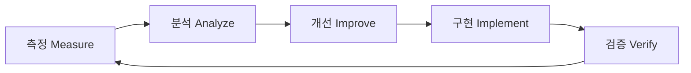

# 지속적 개선 프로세스 (Continuous Improvement Process)

> 프로젝트와 팀이 함께 성장하기 위한 체계적인 개선 프로세스

## 🔄 개선 사이클



## 📊 피드백 수집 채널

### 1. 코드 리뷰
- **수집 방법**: PR 코멘트, 리뷰 세션
- **주기**: 매 PR
- **담당**: 모든 개발자
- **기록 위치**: `docs/feedback/code-reviews/`

### 2. 팀 회고
- **수집 방법**: 스프린트 회고 미팅
- **주기**: 2주
- **담당**: 스크럼 마스터
- **기록 위치**: `docs/feedback/retrospectives/`

### 3. 사용자 피드백
- **수집 방법**: 이슈 트래커, 설문조사
- **주기**: 지속적
- **담당**: Product Owner
- **기록 위치**: `docs/feedback/user-feedback/`

### 4. 메트릭 분석
- **수집 방법**: 자동화된 측정 도구
- **주기**: 주간/월간
- **담당**: Tech Lead
- **기록 위치**: `docs/QUALITY_METRICS.md`

## 🎯 개선 영역

### 코드 품질
| 영역 | 현재 상태 | 목표 | 개선 방법 |
|------|----------|------|-----------|
| 테스트 커버리지 | 45% | 80% | TDD 도입, 테스트 자동화 |
| 코드 리뷰 | 수동 | 자동화 30% | SonarQube, ESLint 강화 |
| 문서화 | 70% | 100% | 문서 템플릿, 자동 생성 |

### 개발 프로세스
| 영역 | 현재 상태 | 목표 | 개선 방법 |
|------|----------|------|-----------|
| 빌드 시간 | - | <2분 | 캐싱, 병렬 처리 |
| 배포 자동화 | 부분 | 완전 자동화 | CI/CD 파이프라인 |
| 모니터링 | 기본 | 고급 | APM, 로그 분석 |

### 팀 역량
| 영역 | 현재 상태 | 목표 | 개선 방법 |
|------|----------|------|-----------|
| TypeScript | 중급 | 고급 | 스터디, 코드 리뷰 |
| 테스트 작성 | 초급 | 중급 | 교육, 페어 프로그래밍 |
| 도메인 지식 | 중급 | 고급 | 문서화, 지식 공유 |

## 📈 개선 추적

### 2025년 1월 - 개선 사항
```diff
+ Joi validation 도입으로 입력 검증 강화
+ Transaction support로 데이터 일관성 개선
+ Authorization checks로 보안 강화
+ 프로젝트 거버넌스 문서 작성
+ Makefile로 작업 자동화
- TypeScript 에러 2개 미해결
- 테스트 커버리지 부족
```

### 2025년 2월 - 계획
```yaml
목표:
  - 테스트 커버리지 55% 달성
  - TypeScript 에러 완전 해결
  - SonarQube 통합
  - E2E 테스트 기반 구축

액션:
  - [ ] 핵심 서비스 단위 테스트 작성
  - [ ] 타입 정의 개선
  - [ ] CI/CD 파이프라인 구축
  - [ ] 성능 측정 도구 도입
```

## 🏆 베스트 프랙티스 발굴

### 채택된 프랙티스
1. **Transaction Pattern**
   ```typescript
   // 모든 관련 DB 작업을 트랜잭션으로 묶기
   return await prisma.$transaction(async (tx) => {
     // 여러 DB 작업
   });
   ```

2. **Validation Middleware**
   ```typescript
   // 모든 엔드포인트에 Joi 검증 적용
   router.post('/', validate(schema), controller);
   ```

3. **Error Handling**
   ```typescript
   // 일관된 에러 응답 형식
   throw new AppError('message', statusCode);
   ```

### 검토 중인 프랙티스
- Repository Pattern 도입
- CQRS 패턴 적용
- Event Sourcing
- Microservices 전환

## 📚 학습 및 성장

### 팀 학습 계획
| 주제 | 우선순위 | 방법 | 일정 |
|------|---------|------|------|
| Advanced TypeScript | High | 온라인 코스, 실습 | 2025 Q1 |
| Testing Best Practices | High | 워크샵, 페어 프로그래밍 | 2025 Q1 |
| Domain-Driven Design | Medium | 북 스터디 | 2025 Q2 |
| Performance Optimization | Medium | 사례 연구 | 2025 Q2 |
| Security Best Practices | High | 외부 교육 | 2025 Q1 |

### 지식 공유 세션
- **Tech Talk**: 매월 첫째 주 금요일
- **Code Review Session**: 매주 수요일
- **Architecture Discussion**: 매월 셋째 주 화요일

## 🔧 도구 및 자동화

### 현재 사용 중
- ✅ ESLint
- ✅ Prettier
- ✅ TypeScript
- ✅ Makefile
- ✅ Docker

### 도입 예정
- ⏳ SonarQube (2025 Q1)
- ⏳ Grafana + Prometheus (2025 Q2)
- ⏳ Sentry (2025 Q1)
- ⏳ GitHub Actions (2025 Q1)
- ⏳ Playwright (2025 Q2)

## 📋 개선 제안 프로세스

### 제안 방법
1. **이슈 생성**: GitHub Issues에 'improvement' 라벨
2. **RFC 작성**: 큰 변경사항은 RFC 문서 작성
3. **팀 논의**: 주간 미팅에서 논의
4. **POC**: 필요시 개념 증명 구현
5. **승인 및 구현**: 합의 후 구현

### 제안 템플릿
```markdown
## 개선 제안

### 문제점
현재 어떤 문제가 있는가?

### 제안 솔루션
어떻게 개선할 것인가?

### 기대 효과
- 생산성 향상: X%
- 품질 개선: Y%
- 비용 절감: Z%

### 구현 계획
1. Step 1
2. Step 2
3. Step 3

### 리스크
- Risk 1
- Risk 2
```

## 🎖️ 개선 성과 인정

### 월간 우수 개선
- **2025년 1월**: Validation Middleware 도입
  - 제안자: Backend Team
  - 효과: 입력 검증 자동화, 보안 강화

### 분기별 혁신상
- **2025 Q1**: (예정)

## 📊 ROI 측정

### 개선 투자 대비 효과
| 개선 사항 | 투자 시간 | 절감 시간/월 | ROI |
|-----------|----------|-------------|-----|
| Makefile 자동화 | 8h | 20h | 250% |
| Validation 미들웨어 | 16h | 10h | 62.5% |
| 문서 템플릿 | 4h | 8h | 200% |

## 🔮 미래 비전

### 2025년 말 목표
- 완전 자동화된 CI/CD
- 테스트 커버리지 90%
- Zero-downtime 배포
- 실시간 모니터링 대시보드
- 마이크로서비스 준비

### 2026년 비전
- 클라우드 네이티브 전환
- AI 기반 코드 리뷰
- 자동 스케일링
- Chaos Engineering
- 100% 문서 자동화

## 📝 개선 로그

### 2025-01-14
- ✅ 프로젝트 거버넌스 체계 구축
- ✅ 품질 메트릭 관리 시작
- ✅ 지속적 개선 프로세스 문서화

### 다음 리뷰: 2025-01-28
- [ ] 1월 개선 사항 평가
- [ ] 2월 목표 설정
- [ ] 프로세스 조정

---

*"The only way to do great work is to love what you do and continuously improve."*

**Owner**: Tech Lead
**Last Updated**: 2025-01-14
**Next Review**: 2025-01-28