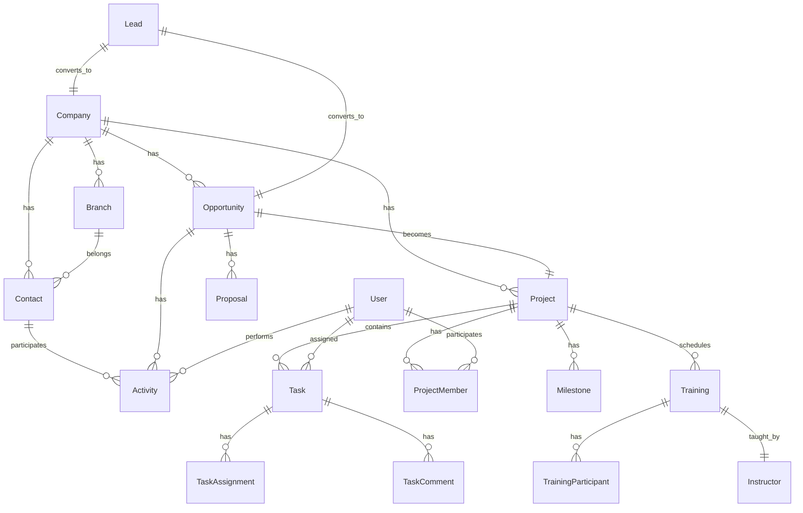

# CRM AUGU - Phase 2 개발 상세 계획서

## 📋 개요
Phase 2는 CRM의 핵심 비즈니스 기능을 구현하는 단계로, HRD 산업 특화 기능을 포함한 고객 중심의 워크플로우를 완성합니다.

## 🎯 Phase 2 목표
- **고객 통합 관리**: Company-Branch-Contact 계층구조 완성
- **영업 프로세스 자동화**: Lead → Opportunity → Project 전환 워크플로우
- **프로젝트 실행 관리**: HRD 교육 프로젝트 라이프사이클 관리
- **성과 측정 체계**: KPI 및 메트릭스 기반 의사결정 지원

## 🏗️ 아키텍처 원칙

### 1. 도메인 중심 설계 (Domain-Driven Design)
```
Domain Layer
├── Entities: 비즈니스 핵심 개체
├── Value Objects: 불변 값 객체
├── Domain Services: 비즈니스 로직
└── Domain Events: 도메인 이벤트

Application Layer
├── Services: 유스케이스 구현
├── DTOs: 데이터 전송 객체
└── Validators: 입력 검증

Infrastructure Layer
├── Repositories: 데이터 접근
├── External Services: 외부 서비스 연동
└── Configurations: 설정 관리
```

### 2. 일관된 API 패턴
- RESTful 원칙 준수
- 표준화된 응답 형식
- 페이지네이션 지원
- 필터링 및 정렬 기능
- 벌크 작업 지원

### 3. 데이터 무결성
- 트랜잭션 관리
- Soft Delete 적용
- 감사 로그 (Audit Trail)
- 참조 무결성 보장

## 📊 데이터 모델 관계도



## 🔄 비즈니스 워크플로우

### Lead → Opportunity → Project 전환 플로우
```
[Lead 생성]
    ↓
[BANT 평가]
    ↓
[Lead 전환] → [Company 생성/선택]
    ↓
[Opportunity 생성]
    ↓
[제안서 작성]
    ↓
[계약 성사]
    ↓
[Project 생성]
    ↓
[교육 일정 수립]
    ↓
[실행 및 정산]
```

## 📝 상세 구현 계획

### Module 1: Customer Management (고객 통합 관리)
**목적**: Company-Branch-Contact 계층구조 완성 및 360도 고객 뷰 제공

#### 1.1 Company Service 확장
```typescript
// 추가 기능
- 고객 세그먼테이션 (규모, 산업, 가치)
- 고객 건강도 점수 (Customer Health Score)
- 거래 이력 통합 조회
- 중복 고객 병합
- 벌크 임포트/익스포트
```

#### 1.2 Contact Management
```typescript
// Contact 확장 기능
- 의사결정 구조 매핑 (Decision Maker Matrix)
- 커뮤니케이션 이력 관리
- 선호 채널 관리
- 관계도 (Relationship Map)
- 이메일/SMS 수신 동의 관리
```

#### 1.3 Customer 360 View
```typescript
// 통합 대시보드
- 기본 정보 & 계층구조
- 영업 기회 현황
- 진행중인 프로젝트
- 교육 이력
- 재무 현황 (매출, 미수금)
- 커뮤니케이션 타임라인
```

### Module 2: Sales Pipeline Enhancement (영업 파이프라인 고도화)
**목적**: 영업 프로세스 자동화 및 예측 정확도 향상

#### 2.1 Opportunity Management 고도화
```typescript
// 추가 기능
- Stage 전환 자동화 규칙
- 확률 자동 계산 (AI/ML 기반)
- 경쟁사 분석
- Win/Loss 분석
- 영업 속도 (Sales Velocity) 측정
```

#### 2.2 Proposal Management
```typescript
// Proposal 모델 구현
interface Proposal {
  id: string
  opportunityId: string
  code: string
  version: string
  title: string
  content: string // HTML/Markdown
  items: ProposalItem[]
  totalAmount: number
  discount: number
  finalAmount: number
  validUntil: Date
  status: ProposalStatus
  attachments: Attachment[]
  approvalFlow: ApprovalStep[]
}

// 기능
- 제안서 템플릿 관리
- 버전 관리
- 전자 서명 연동
- PDF 생성
- 승인 워크플로우
```

#### 2.3 Sales Analytics
```typescript
// 영업 분석 지표
- 파이프라인 분석 (단계별 전환율)
- 영업 예측 (Forecast)
- 담당자별 성과
- 팀별 성과
- 상품별 판매 분석
```

### Module 3: Project Management (프로젝트 관리)
**목적**: HRD 교육 프로젝트 라이프사이클 관리

#### 3.1 Project Model
```typescript
interface Project {
  id: string
  code: string
  name: string
  description: string
  type: ProjectType // TRAINING, CONSULTING, ASSESSMENT
  companyId: string
  opportunityId: string
  contractAmount: number
  startDate: Date
  endDate: Date
  status: ProjectStatus
  pmId: string // Project Manager
  members: ProjectMember[]
  milestones: Milestone[]
  budget: Budget
  actualCost: number
  profitMargin: number
}
```

#### 3.2 Training Management
```typescript
interface Training {
  id: string
  projectId: string
  code: string
  title: string
  courseId: string // 과정 ID
  instructorId: string
  venue: string
  startDateTime: Date
  endDateTime: Date
  participants: Participant[]
  materials: Material[]
  evaluations: Evaluation[]
  attendance: Attendance[]
}

// 기능
- 교육 일정 관리
- 강사 배정 및 스케줄링
- 교육장 예약 관리
- 참석자 관리
- 교육 자료 배포
- 만족도 평가
- 수료증 발급
```

#### 3.3 Resource Management
```typescript
// 자원 관리
- 강사 스케줄 관리
- 강사 전문분야 매칭
- 교육장 예약 시스템
- 교육 자재 재고 관리
- 비용 정산
```

### Module 4: Task Management (태스크 관리)
**목적**: 프로젝트 실행을 위한 세부 작업 관리

#### 4.1 Task Model
```typescript
interface Task {
  id: string
  projectId: string
  parentTaskId?: string // 하위 태스크 지원
  title: string
  description: string
  type: TaskType
  priority: Priority
  status: TaskStatus
  assigneeId: string
  dueDate: Date
  estimatedHours: number
  actualHours: number
  dependencies: TaskDependency[]
  attachments: Attachment[]
  comments: Comment[]
  checklist: ChecklistItem[]
}
```

#### 4.2 Task Features
```typescript
// 기능
- 칸반 보드 뷰
- 간트 차트 뷰
- 태스크 템플릿
- 반복 태스크
- 태스크 자동화 (트리거 기반)
- 시간 추적
- 워크플로우 자동화
```

### Module 5: Activity Management (활동 관리)
**목적**: 모든 고객 접점 활동 통합 관리

#### 5.1 Activity Types
```typescript
enum ActivityType {
  CALL = 'CALL',
  EMAIL = 'EMAIL',
  MEETING = 'MEETING',
  VISIT = 'VISIT',
  TASK = 'TASK',
  NOTE = 'NOTE',
  DOCUMENT = 'DOCUMENT'
}

interface Activity {
  id: string
  type: ActivityType
  subject: string
  description: string
  entityType: string // Company, Contact, Opportunity, Project
  entityId: string
  userId: string
  startTime: Date
  endTime?: Date
  location?: string
  participants: Participant[]
  outcome?: string
  nextAction?: string
  attachments: Attachment[]
}
```

#### 5.2 Activity Features
```typescript
// 기능
- 캘린더 통합
- 이메일 연동
- 자동 로깅
- 활동 템플릿
- 팔로우업 리마인더
- 활동 보고서
```

### Module 6: KPI & Metrics (성과 지표 관리)
**목적**: 데이터 기반 의사결정 지원

#### 6.1 KPI Categories
```typescript
// 영업 KPI
- 신규 리드 수
- 전환율 (Lead → Opportunity → Won)
- 평균 거래 규모
- 영업 사이클
- Win Rate

// 프로젝트 KPI
- 프로젝트 수익성
- 일정 준수율
- 예산 준수율
- 고객 만족도

// 교육 KPI
- 교육 만족도
- 수료율
- 재교육률
- 강사 평가

// 고객 KPI
- 고객 생애 가치 (CLV)
- 고객 유지율
- NPS (Net Promoter Score)
- 고객 건강도
```

#### 6.2 Metrics Dashboard
```typescript
interface MetricsDashboard {
  period: DateRange
  metrics: Metric[]
  charts: Chart[]
  trends: Trend[]
  alerts: Alert[]
  recommendations: Recommendation[]
}

// 기능
- 실시간 대시보드
- 커스텀 리포트 빌더
- 자동 리포트 생성
- 이상 징후 알림
- 예측 분석
```

## 🚀 구현 순서 및 일정

### Week 1-2: Customer Management
- [ ] Company Service 확장
- [ ] Contact 고도화
- [ ] Customer 360 View 구현
- [ ] 테스트 케이스 작성

### Week 3-4: Sales Pipeline
- [ ] Opportunity 고도화
- [ ] Proposal 모델 구현
- [ ] Sales Analytics 구현
- [ ] 테스트 케이스 작성

### Week 5-6: Project Management
- [ ] Project 모델 구현
- [ ] Training Management 구현
- [ ] Resource Management 구현
- [ ] 테스트 케이스 작성

### Week 7: Task Management
- [ ] Task 모델 구현
- [ ] 칸반/간트 뷰 구현
- [ ] 워크플로우 자동화
- [ ] 테스트 케이스 작성

### Week 8: Activity & KPI
- [ ] Activity Management 구현
- [ ] KPI Framework 구현
- [ ] Metrics Dashboard 구현
- [ ] 통합 테스트

## 🔧 기술 구현 가이드라인

### 1. Service Layer Pattern
```typescript
export class ServiceName {
  // CRUD Operations
  async create(input: CreateInput, userId: string): Promise<Entity>
  async findMany(filter: Filter, pagination: Pagination): Promise<PaginatedResult>
  async findById(id: string): Promise<Entity>
  async update(id: string, input: UpdateInput, userId: string): Promise<Entity>
  async delete(id: string, userId: string): Promise<void>
  
  // Business Operations
  async businessOperation(params: Params): Promise<Result>
  
  // Analytics & Reports
  async getAnalytics(filter: Filter): Promise<Analytics>
}
```

### 2. Controller Pattern
```typescript
export const controllerAction = async (
  req: AuthRequest,
  res: Response,
  next: NextFunction
) => {
  try {
    const result = await service.method(req.body, req.user!.userId)
    res.json({
      success: true,
      data: result,
      meta: { timestamp: new Date().toISOString() }
    })
  } catch (error) {
    next(error)
  }
}
```

### 3. Validation Pattern
```typescript
const schema = z.object({
  body: z.object({
    field: z.string().min(1).max(100),
    // ... validation rules
  })
})
```

### 4. Transaction Pattern
```typescript
const result = await prisma.$transaction(async (tx) => {
  // Multiple operations in transaction
  const entity1 = await tx.model1.create({ ... })
  const entity2 = await tx.model2.update({ ... })
  return { entity1, entity2 }
})
```

## 📊 성공 지표

### 기술적 지표
- API 응답 시간 < 200ms (95 percentile)
- 테스트 커버리지 > 80%
- 코드 품질 점수 > A
- 무중단 운영 99.9%

### 비즈니스 지표
- 영업 사이클 30% 단축
- 프로젝트 수익성 20% 향상
- 고객 만족도 90% 이상
- 사용자 채택률 95% 이상

## 🔒 보안 고려사항
- 역할 기반 접근 제어 (RBAC) 적용
- 데이터 암호화 (at rest & in transit)
- 감사 로그 완벽 구현
- PII 데이터 마스킹
- API Rate Limiting

## 📚 참고사항
- 모든 새로운 기능은 기존 코드베이스와 일관성 유지
- TypeScript 엄격 모드 준수
- Prisma 스키마 마이그레이션 관리
- API 문서 자동 생성 (Swagger)
- 단위 테스트 및 통합 테스트 필수

---

이 계획서는 Phase 2 개발의 청사진으로, 구현 과정에서 필요에 따라 조정될 수 있습니다.